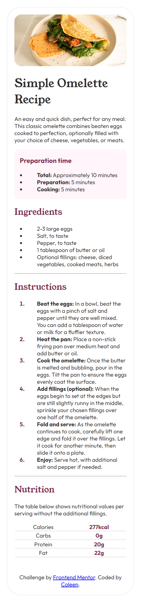
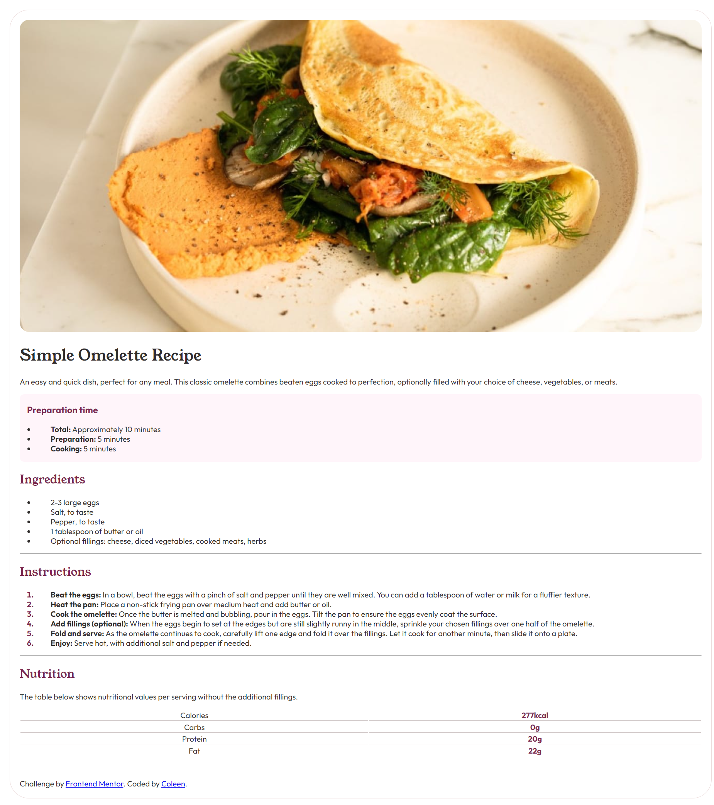

# Frontend Mentor - Recipe page solution

This is a solution to the [Recipe page challenge on Frontend Mentor](https://www.frontendmentor.io/challenges/recipe-page-KiTsR8QQKm). Frontend Mentor challenges help you improve your coding skills by building realistic projects. 

## Table of contents

- [Overview](#overview)
  - [The challenge](#the-challenge)
  - [Screenshot](#screenshot)
  - [Links](#links)
- [My process](#my-process)
  - [Built with](#built-with)
- [Author](#author)

## Overview

### Screenshot

1. Vew from mobile browser 
    
2. View from desktop browser 
   

### Links

- Solution URL: [https://github.com/kewlinnn/Frontend-Mentor-Challenges/tree/main/recipe-page-main](https://github.com/kewlinnn/Frontend-Mentor-Challenges/tree/main/recipe-page-main)
- Live Site URL: [https://kewlinnn.github.io/Frontend-Mentor-Challenges/recipe-page-main/](https://kewlinnn.github.io/Frontend-Mentor-Challenges/recipe-page-main/)

## My process

### Built with

- Semantic HTML5 markup
- CSS custom properties

## Author

- Github - [kewlinnn](https://github.com/kewlinnn)
- Frontend Mentor - [@kewlinnn](https://www.frontendmentor.io/profile/kewlinnn)
